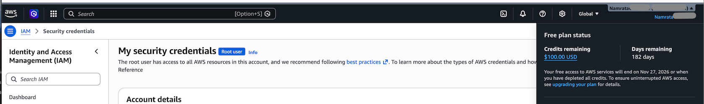
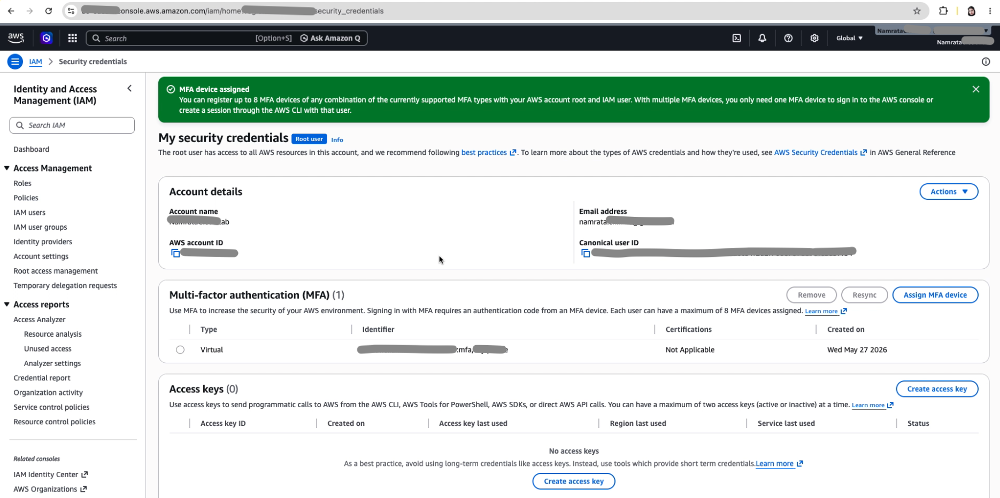
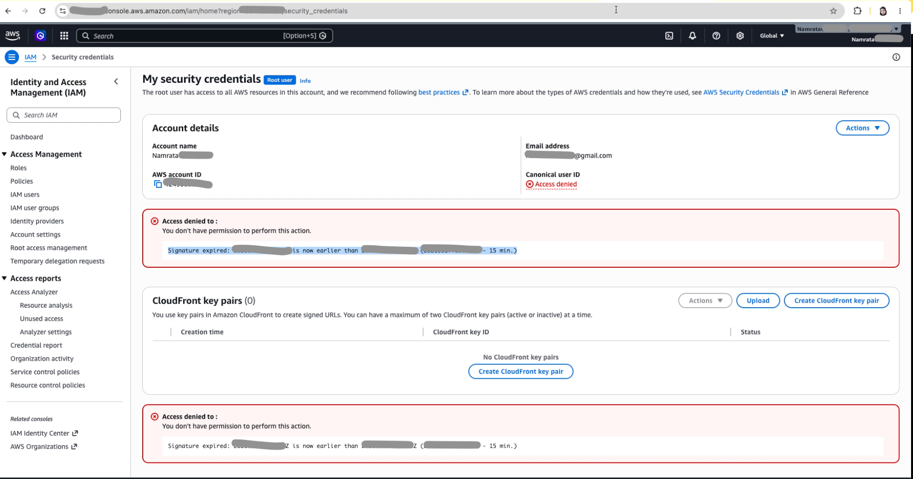

# Day 01 - AWS Account Security

Today’s focus is to secure the AWS root account with MFA and understand why account security should come before creating cloud resources.

## Goal

```text
Understand MFA → Enable on root account-->Verify
```
---

## Concept

The AWS root user is the most powerful identity in an AWS account.

It has full access to billing, security settings, users, permissions, and all AWS resources.

Because of this, the root account should be protected immediately using MFA.

---

## Hands-on

Enable MFA on root user

---

## Steps Performed

### Step 1: Created AWS account.

```text
During the account setup, I followed the required AWS sign-up steps such as:

- email verification
- contact information
- payment method setup
- identity verification
- support plan selection

This created the main AWS account.
```

### Step 2: Logged in as the AWS root user.

### Step 3: Opened the security credentials page.

```text
After signing in, I opened the account/security credentials section.

This is where root user security settings can be managed.

From this page, I started the MFA setup process.
```

### Step 4: Downloaded an Authenticator App on Mobile 

```text
- Before enabling MFA, I downloaded an authenticator app on my mobile phone.

Examples of authenticator apps are:
- Google Authenticator
- Microsoft Authenticator
- Authy

I used the authenticator app to generate temporary MFA codes for AWS login.
```

### Step 5: Started MFA setup for the root user.

```text
I selected the option to assign or enable MFA for the root user.

MFA is important because it adds an extra layer of protection to the AWS account.
Even if someone gets the password, they still need the second authentication factor.
```

### Step 6: Selected Authenticator App as MFA Device.

```text
I opened the authenticator app on my mobile phone and scanned the QR code.
After scanning, the app started showing a temporary 6-digit code for my AWS account.
```

### Step 7: Entered the required temporary code from the mobile app as prompted on AWS.

```text
This step confirms that the authenticator app is correctly connected to the AWS root account.
```  

### Step 8: Analysed the `Signature expired` error faced, While enabling MFA.

```text
While enabling MFA, I faced a Signature expired error.

I analysed the issue and understood that AWS requests are time-sensitive.

If the laptop/system time is incorrect, AWS may reject the request because the request timestamp is not valid.
```

### **Step 9:** Fixed the error.

```text
Identified that my laptop time was incorrect.
Corrected the laptop time and retried the MFA setup.
```

### **Step 10:** Signed out from AWS.

```text
After fixing the laptop time, I signed out from AWS.
```

### **Step 11:** Signed in again.

```text
I signed in again using the AWS root user credentials.
```

### **Step 12:** Enabled MFA successfully.

```text
I completed the MFA setup successfully for the root user.
```

### **Step 13:** Verified security and account status 

## What I verified

Verified AWS Credits



Verified Root MFA Status


Captured Troubleshooting Screenshot



### **Step 14:** Performed cleanup and Cost Tracking.

## Cleanup
No paid AWS application resources were created.

For more cleanup details, see

```text
cleanup-checklist.md
```

## Cost

Estimated cost: **£0 / $0**

No EC2, S3, Lambda, API Gateway, database, or paid application resource was created during this task.

Checked the cost on billing dashboard

For monthly cost tracking, see:

```text
../../03-cost-tracker/monthly-cost-tracker.md
```

---

## Issue Faced

For detailed troubleshooting, see:

```text
troubleshooting.md
```

---

## Interview Note

Q: Why should MFA be enabled on the AWS root account?

A: The root account has full access to the AWS account. MFA adds an extra layer of protection, so even if the password is compromised, the account still requires a second authentication factor.

For detailed interview answers, see:

```text
../../04-interview-prep/03-iam-security.md
```

---

## Reflection

Day 1 helped me understand that AWS account security should be completed before creating any cloud resources.

The key learning was:

The AWS root user has full control over the account.
I must protect the root user first by enabling MFA.

MFA adds an important second layer of security because authenticator apps generate temporary security codes.

I also learned that AWS requests are time-sensitive.
If the laptop or system time is incorrect, AWS may show a **Signature expired** error.

---

## Status

Completed

---

## Next Step

```text
Day 02 - Billing, Credits, and Budget Alerts
```

