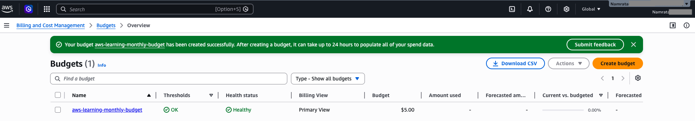
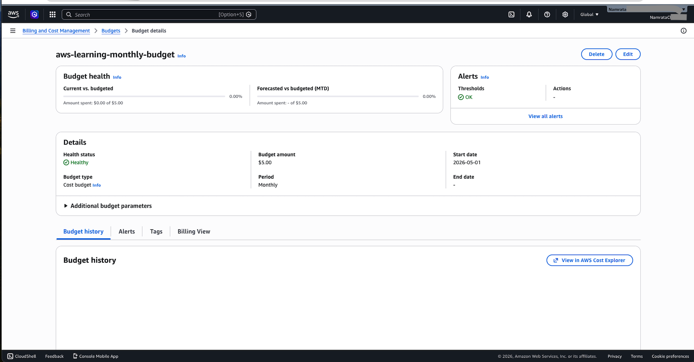
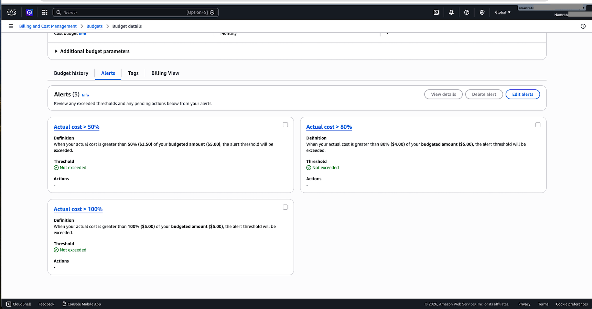
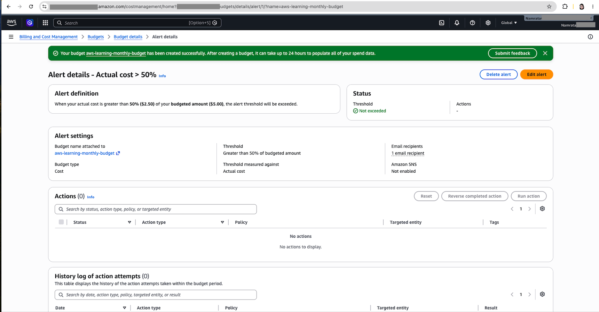

# Day 02 - Billing, Credits, and Budget Alerts

Today’s focus is to create a cost-safe AWS foundation before creating cloud resources.

## Goal

```text
Understand billing → Check credits → Create budget → Enable alerts
```
---

## Concept

AWS cost safety should start before creating resources.

Before using services like EC2, S3, Lambda, API Gateway, or databases, it is important to understand:

where to check billing
how AWS credits work
how budgets help
how alerts reduce billing fear
why cost tracking should be part of cloud learning
AWS credits are helpful, but they should not create careless usage habits.

---

## Hands-on

Beginner cost-safety setup:

Create 3 budget alerts at 50%, 80%, and 100% for a $5 monthly AWS cost budget.

```text
Budget type: Cost budget
Budget period: Monthly
Budget amount: $5
Alert 1: 50%
Alert 2: 80%
Alert 3: 100%
Budget actions: Not enabled
```

---

## Steps Performed

### Step 1: Opened AWS Billing and Cost Management.

```text
From the AWS Console, I opened the account menu from the top-right corner.

Then I opened:
Billing and Cost Management

This section is used to check AWS charges, credits, budgets, invoices, and cost-related settings.
```

### Step 2: Created a monthly AWS cost budget.

```text
For this beginner setup, I created a cost budget.

Budget type: Cost budget
Budget period: Monthly
Budget amount: $5

This means the budget resets every month and tracks monthly AWS spending.
The goal is not to spend $5, but to receive early alerts if usage starts increasing.
```

### Step 3: Added First Alert at 50%

```text
Alert 1: 50%

For a $5 budget, 50% means:

$2.50

This alert gives an early warning if spending reaches half of the monthly budget.
```

### Step 4: Configured the second alert threshold at 80%

```text
Alert 2: 80%

For a $5 budget, 80% means:

$4.00

This alert gives a stronger warning before the full budget is reached.
```

### Step 5: Then Added Third Alert at 100%

```text
Alert 3: 100%

For a $5 budget, 100% means:

$5.00

This alert notifies me when the full budget amount is reached.
```

### Step 6: Added an email address as the notification recipient.

```text
This means AWS can send an email alert when the budget reaches the configured thresholds.

Important:

After adding an email address, AWS may require email confirmation before notifications are active.
```

### Step 7: Did Not Enable Budget Actions

```text
Budget actions: Not enabled

For beginner learning, I only wanted alerts and notifications.

Budget actions can automatically apply permissions or controls, so I avoided them for this basic setup.
```

### Step 8: Verified the outcome
## What I verified

Budget Created


Reviewed Budget Configuration


Alets


Alert in detail



### Step 9: Performed cleanup and Cost Tracking.

## Cleanup
No paid AWS application resources were created.

For more cleanup details, see

```text
cleanup-checklist.md
```

## Cost

Estimated cost: **£0 / $0**

No EC2, S3, Lambda, API Gateway, database, or paid application resource was created during this task.

Checked the cost on billing dashboard

For monthly cost tracking, see:

```text
../../03-cost-tracker/monthly-cost-tracker.md
```

---

## Related Mini Project

This day connects to:

```text
../../02-mini-projects/01-beginner-friendly-projects/billing-alerts-setup/
```
Project:

### Billing Alerts Setup

This project documents the budget and alert setup as a reusable cost-safety project.


---

## Interview Notes

1. Why should you create an AWS Budget before creating resources?
An AWS Budget helps track monthly spending and sends alerts when actual or forecasted costs reach configured thresholds. 
This reduces billing fear and helps beginners learn AWS safely.

2. How many notifications can be added to one AWS Budget?

3. When a billing alarm is triggered how will you know?

4. What is the difference between an AWS Budget alert and a CloudWatch billing alarm?
 
For detailed interview answers, see:

```text
../../04-interview-prep/03-iam-security.md
```

---

## Reflection

Day 2 helped me understand that AWS cost safety should be planned before creating any cloud resources.

The key learning was:

AWS credits are helpful, but they are not a replacement for cost monitoring.
I must track credits, budgets, alerts, and estimated charges regularly.

I learned that AWS Billing and Cost Management is the main place to check charges, credits, budgets, and invoices.

I also learned that a monthly budget helps me monitor spending.
For a $5 monthly budget:

```text
50%  = $2.50
80%  = $4.00
100% = $5.00
```

Budget alerts can notify me by email when spending reaches these thresholds, so I can take early action before costs increase.

For this beginner setup, I used alert-only budget notifications and did not enable budget actions.

No paid AWS application resources were created on Day 02.

---

## Status

Completed.

---

## Next Step

Day 03 - Cloud Basics
