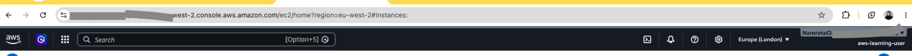

# Day 03 - Cloud Basics

This day focuses on understanding basic AWS cloud concepts before creating resources.

## Goal

```text
Understand Regions, Availability Zones, Edge Locations, and the Shared Responsibility Model.
```
---

## Concept

| Concept | Simple Meaning |
|---|---|
| Region | Geographical area where AWS resources are created |
| Availability Zone | Isolated data center group inside a Region |
| Edge Location | Location used to deliver content closer to users |
| Shared Responsibility Model | AWS protects the cloud; customer protects what they create in the cloud |

For detailed notes, see:

```text
notes.md
```

---

## Hands-on

- Explore the Console for aformentioned key concepts.
- Select suitable region.

---

## Steps Performed

### Step 1: Opened the AWS Console

```text
I signed in to the AWS Console and reviewed the main navigation area.
```

### Step 2: Checked the selected AWS Region

```text
I checked the Region selector in the AWS Console.

This helped me understand that AWS resources are created in specific Regions.
```

### Step 3: Noted my selected Region

## My Selected Region

```text
Europe (London) - eu-west-2

Reason:
 
I am currently in the UK, 
so London is suitable for learning unless a service is unavailable there.
```

### Step 4: Reviewed AWS Global Infrastructure conceptually

### Step 5: Documented AWS vs customer responsibilities

```text
I documented the basic idea of the Shared Responsibility Model.

AWS is responsible for security of the cloud.
The customer is responsible for security in the cloud.
```

### Step 6: Performed cleanup and Cost Tracking.

## Cleanup
No paid AWS application resources were created.

For more cleanup details, see

```text
cleanup-checklist.md
```

## Cost

Estimated cost: **£0 / $0**

No EC2, S3, Lambda, API Gateway, database, or paid application resource was created during this task.

Checked the cost on billing dashboard

For monthly cost tracking, see:

```text
../../03-cost-tracker/monthly-cost-tracker.md
```

----

## What I verified
My Selected Region


---

## Issue Faced

No major issue.

---

## Status

In Progress.

---

## Interview Note
Question: What is the difference between a Region and an Availability Zone?

Answer: A Region is a geographical area. An Availability Zone is an isolated location inside a Region. A Region usually has multiple Availability Zones.

For interview-style answers, see:
```text
../../04-interview-prep/01-cloud-basics.md`
```
---

## Reflection

Day 3 helped me understand the cloud foundation before creating resources.

The key learning was:

AWS protects the cloud infrastructure.  
I protect what I create and configure in the cloud.

---

## Next Step

Day 04 - IAM Basics